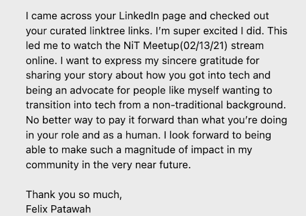

**Meeting of the Board of Directors**

7:00 pm – 8:00 pm CDT  
Wednesday, February 2, 2022  
Video/Teleconference Meeting  
[Join Zoom Meeting](https://us06web.zoom.us/j/81579875543?pwd=UEh5bmo2VDZUT24vNkg5Nm9Yc25iZz09)  
Meeting ID: 815 7987 5543  
Passcode: 439849

**Called to order at:** 7:04 pm CDT

**Adjourned at:** 8:30 pm CDT

**Board Members**

Coty Sutherland  
Desiree Kane   
Holly Grimm  
Ian Her Many Horses  
Natalie Isabel  
Nick Sahler  
Amber Buker

**Invited**

Adam Recvlohe

**Executive Director**

Andrea Delgado-Olson

# Agenda

1. Call to Order 
2. Confirm Quorum
3. Blessing
4. Review/Approve Agenda
5. **Old Business** **to Resolve** (Tabled items from 1-10-22)
    1. January 5th Board Meeting
        1. NiT Email Addresses
        2. Exploring Tools Organizational Development
            * QuickBooks
            * Marketing
            * HR/Payroll/Benefits for nonprofits
            * Project Management/CRM
        3. New Social Media Account Manager! 
        4. Patrick J. McGovern Announcement (January 4, 2022)
6. **New Business**
    2. Executive Director Update
        5. Cultivating NiT Culture
        6. Board Members 1-on-1s
            * [Meeting Schedule Signup](https://docs.google.com/spreadsheets/d/1dMzUZOjby7BVdCHZOszd0DP527N6pQ8DhaKGC-_g-OQ/edit?usp=sharing)
        7. Delegation of Responsibilities/Task Management
        8. Quarterly Board Meeting Proposal
        9. New Organization Tools
        10. Partnerships 
            * Documents Ready to Share - in Hubspot
                1. Corporate Partnership - [https://hubs.ly/Q013b-vb0](https://hubs.ly/Q013b-vb0)
                2. Org/NGO Partnership - [https://hubs.ly/Q013c8-r0](https://hubs.ly/Q013c8-r0)
                3. Academic Partnership - [https://hubs.ly/Q013c94w0](https://hubs.ly/Q013c94w0)
                4. Tribal Nation Partnership - [https://hubs.ly/Q013c9630](https://hubs.ly/Q013c9630)
7. Board Member Updates
8. Set new Action Items
9. Announcements
10. Adjourn

# Discussion/Notes

Old Business

* Reminders to use NiT email addresses for sharing documents, etc.
* Chatting about tools and changes in tools we’re using for the organization

New Business

* Andrea expressed appreciation for everyone being flexible and getting our partnership docs voted on last month. Thanks everyone!
* Reminder that if you won’t be able to make the meeting, let everyone know and make sure that we preserve our culture of transparency and keeping good communication.
* How do we feel about incorporating a council of elders, or other type of advisory council to help us to accelerate our journey to Indigenize this space.
    * Are we thinking of a specific age range that we want to engage with? Any particular skills or community of origin to target?
    * We could model the council after the AISES council of elders.
    * We should ask our membership if they have people that they’d like to nominate.
    * Maybe this could help provide some ethical and respectful way in the perspective of our elders.
* Thoughts about community engagement and building a council/committee to help increase membership engagement by having members bring issues/ideas to a community meeting and make decisions about the business based on the consensus reached there.
* Andrea asks that everyone grab a slot for a quick 1:1
* Andrea’s plate is full and we may be passing on some great opportunities, so during the 1:1s we should share what our interest areas are and make ourselves available to assist to ensure we don’t miss those. Some areas needing help are:
    * Working group for conference - Nick is interested in assisting here with any outstanding actionable task
    * Finance
    * Programs
    * Partnerships
* We need to put together an operations budget. Figuring out a budget for tooling is important, any other items?
    * A part time (~10 hours a week) community manager to help increase engagement with our membership and socials.
    * Consideration for salaries for future employees and how much revenue we need to attain to cover these things.
* Andrea proposed to move to a quarterly board meeting rather than monthly.
    * Longer quarterly may make sense, but may also make space for tasks falling behind and people missing meetings.
    * Longer quarterly meetings with accompanying 1:1s with Andrea to fill in. Working groups would also be meeting on a regular basis.
    * Maybe rethink the purpose of this meeting and bring up specific issues in the board meeting, but accomplish other things in the style of a consent agenda in between meetings.
    * Several +1s for consent agenda. One week prior to the meeting we should have documents ready for review so that we can have a concise agenda.
    * We will try to switch to quarterly after the March meeting. We can always switch back if needed.

## Accept Outstanding Pull Requests

[https://github.com/nativesintech/nonprofit-governance/pulls](https://github.com/nativesintech/nonprofit-governance/pulls)

# Updates from the Board

* Holly
    * Working on Natives in Tech Decentralized Autonomous Organization (DAO)
* Coty
    * Not doing much for NiT these days due to outside commitments :(
    * Interested in: process development, program management-type things, budget/finance (QuickBooks).
* Desiree  
    * Gather.Town for conference - [Link](https://gather.town/invite?token=SnnxllF6PBoqHf9D8qovv2teW7pthT_U)
    * Marketing tools
    * Marketing governance - Example: Do we retweet individual fundraisers? Consensus on answer, document. 
    * 2022 Event Calendar and marketing for that if we want to do that
    * Marketing Calendar for 2022
        * Facebook & LinkedIn events promo Gather events
    * How to submit requests for process or tools refinement
* Ian (absent)
* Natalie (absent)
    * NIT reach outs: 
    * [Who’s Building the Metaverse? Being Intentional about Inclusion During Black History Month and Beyond](https://medium.com/@cynthia.overton/whos-building-the-metaverse-cd0071a7df5f)
    * NIT Conf Response
    * 

* Adam
    * Dropping by to show support and let us know that he is available for questions/ideas/guidance.
    * Share some thoughts about trying MIT again this year.
    * Yes apply, Living Proof Prize
    * Interested in participating via an advisory council whenever that spins up.
* Nick
    * no major updates :(
    * Some updates on Native Owned Businesses, not much movement though.
* Amber
    * Digital Humanities Grant
    * Non-govt grant research 
    * Bandwidth/Neobank hiring

# Action Items

<table>
  <tr>
   <td>Action Item
   </td>
   <td>Person Responsible
   </td>
   <td>Due Date
   </td>
   <td>Status
   </td>
  </tr>
  <tr>
   <td>Mtg to Approve Board Documents
   </td>
   <td>Andrea
   </td>
   <td>
   </td>
   <td>
   </td>
  </tr>
  <tr>
   <td>Start formalizing document about elders council
   </td>
   <td>Andrea
   </td>
   <td>
   </td>
   <td>
   </td>
  </tr>
  <tr>
   <td>Modbuilder Access for Board Members
   </td>
   <td>Desiree
   </td>
   <td>
   </td>
   <td>
   </td>
  </tr>
  <tr>
   <td>Get basic govt grant reqs in place (DUNS and Sam reg) 
   </td>
   <td>Amber
   </td>
   <td>Next meeting
   </td>
   <td>Not started
   </td>
  </tr>
  <tr>
   <td><em>Consider potential elder advisory candidates</em>
   </td>
   <td><em>All?</em>
   </td>
   <td>
   </td>
   <td>
   </td>
  </tr>
  <tr>
   <td><em>Consider fundraising prospects you can sent partner asks to</em>
   </td>
   <td><em>All? </em>
   </td>
   <td>
   </td>
   <td>
   </td>
  </tr>
  <tr>
   <td>Prepare a list of tasks for Native Owned Business project
   </td>
   <td>Nick
   </td>
   <td>
   </td>
   <td>
   </td>
  </tr>
  <tr>
   <td>Generate Income Statement and post in shared folder
   </td>
   <td>Holly
   </td>
   <td>
   </td>
   <td>
   </td>
  </tr>
  <tr>
   <td>Review MIT email and grant requirements
   </td>
   <td><em>All?</em>
   </td>
   <td>
   </td>
   <td>
   </td>
  </tr>
  <tr>
   <td>Add use cases to NiT DAO document
   </td>
   <td>Holly
   </td>
   <td>
   </td>
   <td>
   </td>
  </tr>
  <tr>
   <td>Add board members to NiT ClickUp (<em>Do we want to move NiT Action Items there?</em>)
   </td>
   <td>Andrea
   </td>
   <td>
   </td>
   <td>
   </td>
  </tr>
</table>

